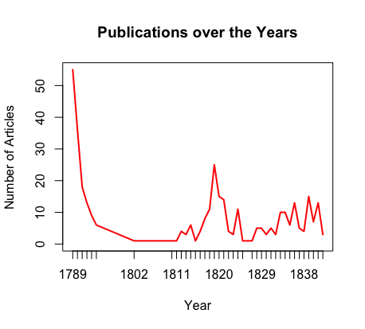

# Part 2 Log

## Excel and R

* When starting anything, always set up your working directory. In RStudio, this is in the bottom right panel.
* When creating the bar plot I noticed that the label for the X-axis is incorrect and that this is actually the label for the Y-axis. Also the title of the plot is the name of the X-axis. The mistakes are in the code ```barplot(counts, main="Cities", xlab="Number of Articles")```
  * To fix this I would write ```barplot(counts, main="Publication Cities", xlab="Cities", ylab="Number of Articles")``` This would also add a proper Y-axis as well
* When i was playing around with the graph types I created a line graph. I was having some troubles making it an actual line till i found the code ```type = "l"```


  * some more playing around led me to changing the line colour with ```col = "red"``` and the line thickness with ```lwd = 2```



## Wget

* When I created the ```urls.txt``` file, I originally saved it in the wrong working directory. The wget didn't work till I saved the file in the same directory that terminal was already working in.
